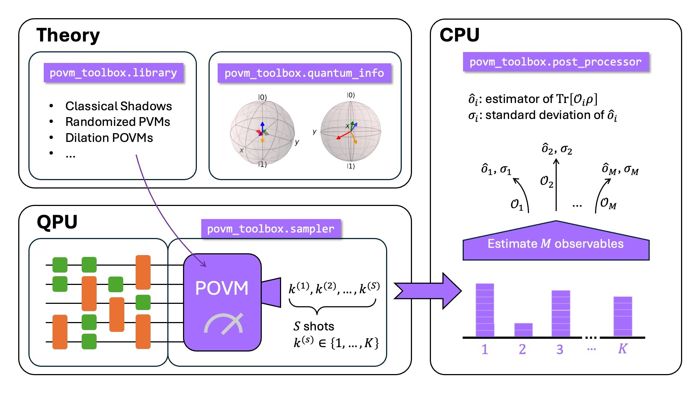

############
POVM Toolbox
############

This is a toolbox for working with positive operator-valued measures (POVMs).
It enables users to use POVMs for sampling the state of quantum circuits (see
also :mod:`povm_toolbox.sampler`) and compute expectation values of any
observable of interest (see also :mod:`povm_toolbox.post_processor`).
The toolbox includes a library of pre-defined POVMs (see
:mod:`povm_toolbox.library`) which provide ready-to-go POVM circuit definitions.
You can also implement your own POVM circuits by following the provided
interface.
Additionally, you can work with POVMs on a quantum-informational theoretical
footing (see :mod:`povm_toolbox.quantum_info`).

In this documentation you can find a number of resources including:

- `explanations <explanations/index.html>`_ to learn more about POVMs
- how to get started with coding using one of the `tutorials <tutorials/index.html>`_
- dive into more specific features with the `how-to guides <how_tos/index.html>`_
- and, of course, look up specific details of the `API <apidocs/povm_toolbox.html>`_

Installation
------------

Make sure that you have the correct Python environment active, into which you
want to install this code, before running the below.

You can install this code via pip:

.. code-block:: bash

   pip install povm-toolbox

Alternatively, you can install it from source:

.. code-block:: bash

   git clone git@github.com:qiskit-community/povm-toolbox.git
   cd povm-toolbox
   pip install -e .

This performs an editable install to simplify code development.

If you intend to develop on this code, you should consider reading the
`contributing guide <https://github.com/qiskit-community/povm-toolbox/blob/main/CONTRIBUTING.md>`_.

Citation
--------

If you use this project, please cite the following reference:

    Laurin E. Fischer, Timothée Dao, Ivano Tavernelli, and Francesco Tacchino;
    "Dual-frame optimization for informationally complete quantum measurements";
    Phys. Rev. A 109, 062415;
    DOI: https://doi.org/10.1103/PhysRevA.109.062415

.. toctree::
  :hidden:

   Documentation Home <self>
   Tutorials <tutorials/index>
   How-To Guides <how_tos/index>
   Explanations <explanations/index>
   API Reference <apidocs/povm_toolbox>
   GitHub <https://github.com/qiskit-community/povm-toolbox>
   Release Notes <release-notes>
